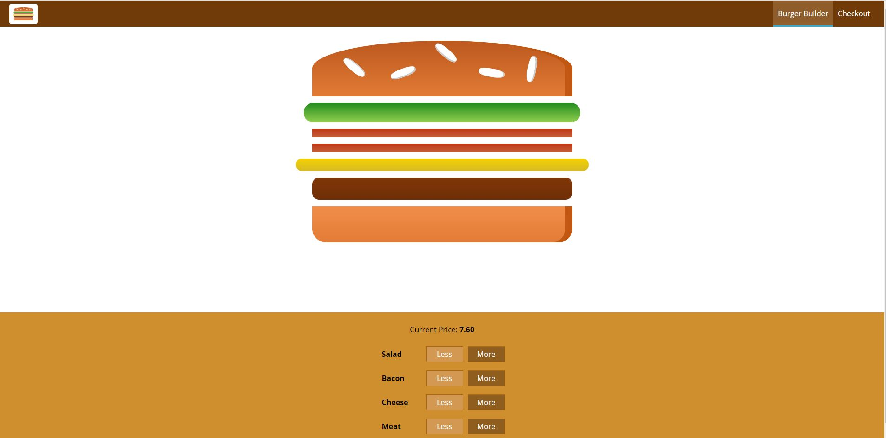
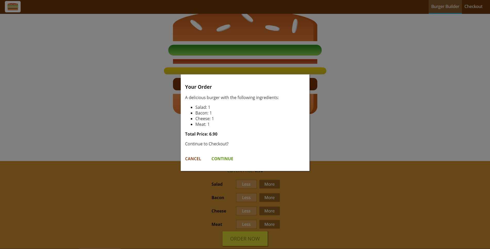

# Burger Builder


## Table of Content

  - [Description](#description)

  - [Installation](#installation)

  - [Usage](#usage)

  - [Licence](#licence)
  
  - [Future Development](#development)

  - [Contributing](#contributing)

  - [Questions](#questions)

 ### Description

Burger Builder is a restaurant app that lets customize the burger that they want to eat. Whenever the user increases or decreases the quantity of an ingredient, the app will update in real-time to display their customized burger and price of the burger. Once the user has cutomized their burger, they will be able to place an order by clicking the 'Order Now' button to proceed to check out. 

 The app is built using Node, React, and Webpack.

 The live app can be accessed [here](https://pacific-stream-43723.herokuapp.com/).

 <p align="center">
    
</p>
 <p align="center">
    
</p>


### Installation

The application can be installed by using the following command: 

```bash
git clone https://github.com/caymanh/burger.git
```

### Usage

The application can be invoked by using the following commands: 

```bash
npm install
npm start
```

### Licence

This application is covered by the [MIT](https://choosealicense.com/licenses/mit/) licence.

### Development

The app is still in development and future updates will include:
- Adding routing to the application
- Adding Redux to the project

### Contributing

Pull requests are welcome. For major changes, please open an issue first to discuss what you would like to change.

### Questions

Please contact me if you have any questions regarding the application:

[Github](https://github.com/caymanh)

[Email](mailto:hengcayman@gmail.com)